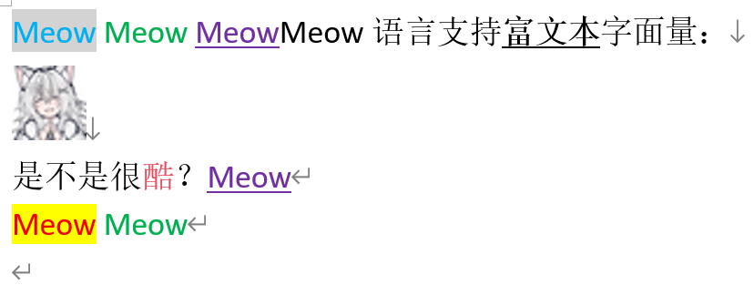
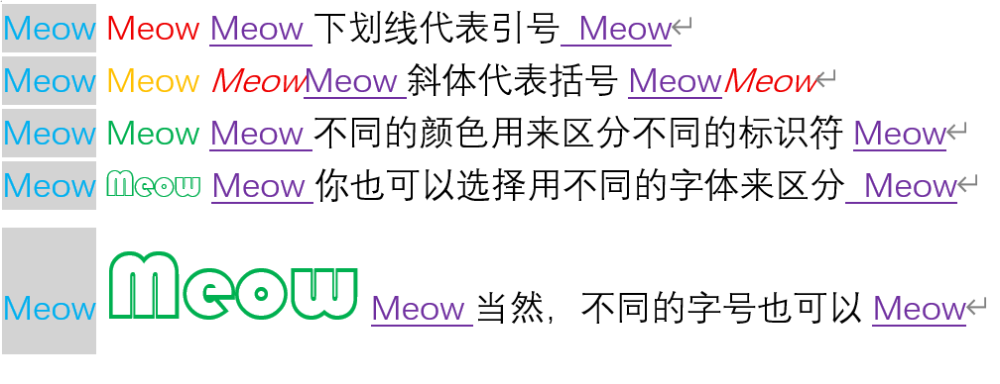
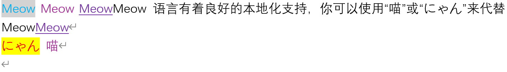

# Meow 语言

次世代编程语言，旨在提供更高效、更直观的编程体验。

## 特性

### 富文本编程

Meow 语言使用 Microsoft Word 作为编辑器，支持富文本编程，允许开发者在代码中嵌入格式化文本、图片和其他内容，并支持将他们输出到控制台。




### 大道至简

Meow 语言的设计理念是大道至简。

Meow 语言废弃了传统语言中的自定义标识符、括号、引号，仅保留了唯一的关键字：`Meow`。

Meow 语言开发者不需要头疼如何给变量命名，只需要为 `Meow` 设置不同的颜色、背景色、字体、字号、粗细等属性就能标识不同的标识符。




### 关键字本地化

与传统语言不同，Meow 语言不要求你只能使用英语中的“Meow”来编写代码。

Meow 语言支持数十种语言中的“喵”！不管你来自哪里，都可以用你熟悉的语言来编写 Meow 代码。
只要颜色、字体、字号、粗细等属性相同，Meow 语言就会认为它们是相同的，你可以任意混用它们。



## 构建 Meow 语言

```bash
./gradlew meow
```


## 运行 Meow 语言

```bash
java -jar meow.jar ./demo/HelloWorld.docx
```

## 开源协议

Meow 语言的所有 Java 源码遵循 [GPLv3](https://www.gnu.org/licenses/gpl-3.0.html) 协议开源发布。

本仓库中的其他文件（`.docx`、`.md`、`.png` 等等）遵循 [CC BY-SA 4.0](https://creativecommons.org/licenses/by-sa/4.0/) 协议开源发布。

## 特别感谢


本项目由 [PLCT 实验室](https://plctlab.org) 赞助支持。


本项目使用 JetBrains IntelliJ IDEA 开发。感谢 JetBrains 为我提供的免费许可！